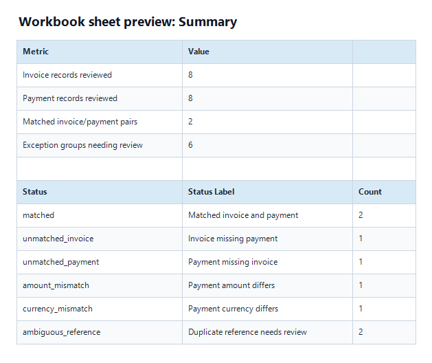
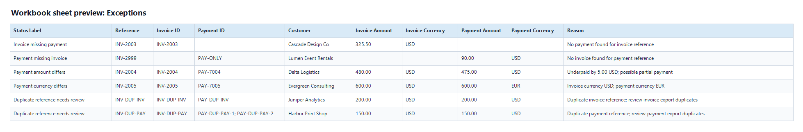
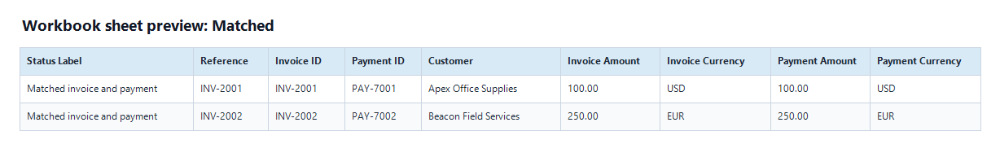

# Invoice Payment Reconciliation Automation

## 60-second client read

This is a Python portfolio demo for automating invoice and payment
reconciliation from CSV/XLSX exports. It validates input rows, matches payments
to invoices, classifies exceptions, and generates reviewable Markdown, CSV, and
XLSX workbook reports for finance or operations teams.

**Best-fit client problem:** a small business, accounting firm, or operations
team manually compares invoice exports with payment exports every week, then
builds exception lists in spreadsheets.

**Business value demonstrated:** faster reconciliation review, repeatable
matching rules, explicit exception categories, cleaner audit output, and fewer
manual spreadsheet checks.

**Technical proof:** Python 3.12+, uv, standard-library CSV parsing,
`openpyxl` for XLSX input and workbook output, dataclass-based records,
validation, deterministic matching rules, exception classification, CLI
commands, pytest, Ruff, synthetic sample data, committed demo report artifacts,
and a generated XLSX workbook.

**Demo safety:** all sample invoices and payments are synthetic. No real
accounting, banking, Stripe, or client data is included.

## What a real client version would adapt

- Client-specific invoice and payment export schemas.
- Matching tolerances for dates, partial payments, rounding, currency, customer
  identifiers, and duplicate references.
- Customer or account identifiers as matching inputs when the client export
  provides reliable IDs.
- Excel workbook output with separate review sheets for matched rows and
  exceptions.
- Scheduled runs or a lightweight upload interface if the client needs
  non-technical usage.
- Handoff documentation for accounting or operations staff.

## Manual process vs automated process

| Manual spreadsheet reconciliation | Automated demo workflow |
|---|---|
| Export invoice and payment files. | Run one `reconcile report` CLI command. |
| Copy/paste rows into spreadsheets. | Load CSV or XLSX exports locally. |
| Filter, sort, and compare references and amounts by hand. | Validate required fields, dates, amounts, and currencies. |
| Manually build exception lists for follow-up. | Apply deterministic matching rules and classify exceptions. |
| Repeat the same checks every week. | Generate Markdown, CSV, XLSX workbook, and workbook sheet previews for review. |

## Project Summary

The current version is a local CLI demo, not a production accounting platform.
It is designed to show practical automation engineering: file ingestion,
validation, deterministic matching, exception classification, report generation,
tests, and a minimal CI quality gate.

## Features

- CSV and XLSX invoice/payment input parsing.
- Required-field validation for invoice and payment rows.
- ISO date parsing and decimal money amount parsing.
- Whitespace trimming for text fields and uppercasing for currency values.
- Exact-reference matching between invoice IDs and payment references.
- Exception categories for invoices missing payments, payments missing
  invoices, amount variances, currency conflicts, and duplicate references.
- Markdown reconciliation report with totals, status summary, sorted detail
  sections, and review notes.
- Summary CSV and details CSV outputs for spreadsheet review.
- XLSX workbook output with `Summary`, `Matched`, `Exceptions`,
  `Invoice Exceptions`, `Payment Exceptions`, and `Details` sheets.
- Synthetic sample data and committed demo-output snapshot.

## Matching rules

| Rule area | Current demo behavior | Client-version adaptation |
|---|---|---|
| Invoice reference | Exact match from `invoice_id` to `payment_reference`. | Map client export reference fields and aliases. |
| Amount | Exact decimal amount match when reference and currency match; differences become amount variance exceptions. | Add rounding rules, fee handling, or configured tolerance bands. |
| Customer/customer identifier | `customer_name` is imported and reported, but it is not used as a matching key. | Add customer, account, email, or ERP IDs when exports provide reliable identifiers. |
| Date range | Dates are parsed and validated, but date windows are not used for matching. | Add payment-window rules, due-date checks, and aging views. |
| Currency | Currency is uppercased during import; reference matches with different currencies become currency conflict exceptions. | Add multi-currency policy, FX handling, and settlement-currency rules. |
| Tolerance | No fuzzy matching, probabilistic scoring, amount tolerance, or date tolerance. | Configure explicit tolerances after accounting approval. |
| Duplicate references | Duplicate invoice or payment references are classified as ambiguous and routed to review. | Add client-specific duplicate handling when source-system rules are known. |
| Partial payments / many-to-one matching | Not allocated; underpayments are amount variance exceptions with a review note. | Add partial-payment allocation and many-to-one matching rules if needed. |

## Demo Workflow

Use PowerShell from the repository root:

1. Install dependencies from the lockfile and run the quality gate.
2. Run the mixed CSV demo and inspect `reports\demo-csv`.
3. Run the equivalent XLSX demo and inspect `reports\demo-xlsx`.
4. Confirm each demo directory contains `reconciliation-report.md`,
   `reconciliation-summary.csv`, `reconciliation-details.csv`, and
   `reconciliation-workbook.xlsx`.
5. Compare generated output with the committed reviewer snapshot under
   `docs/demo-output/mixed-demo/`.

## Installation

Prerequisite: install `uv` from the
[official uv installation guide](https://docs.astral.sh/uv/getting-started/installation/)
if it is not already available on `PATH`.

From a fresh clone:

```powershell
uv sync --locked --dev
```

## CLI Usage

Show top-level help:

```powershell
uv run reconcile --help
```

Show report command help:

```powershell
uv run reconcile report --help
```

Run the mixed CSV demo:

```powershell
uv run reconcile report --invoices sample-data/mixed-demo/invoices.csv --payments sample-data/mixed-demo/payments.csv --out-dir reports\demo-csv
```

Run the equivalent XLSX-input demo:

```powershell
uv run reconcile report --invoices sample-data/mixed-demo/invoices.xlsx --payments sample-data/mixed-demo/payments.xlsx --out-dir reports\demo-xlsx
```

Both demo commands write exactly four files inside the selected output
directory:

- `reconciliation-report.md`
- `reconciliation-summary.csv`
- `reconciliation-details.csv`
- `reconciliation-workbook.xlsx`

## Sample Inputs And Outputs

Synthetic inputs live under `sample-data/`:

- `valid-invoices.csv` and `valid-payments.csv` demonstrate a clean fully
  matched scenario.
- `invalid-invoices.csv` and `invalid-payments.csv` demonstrate validation
  failures.
- `mixed-demo/invoices.csv` and `mixed-demo/payments.csv` demonstrate the main
  portfolio scenario.
- `mixed-demo/invoices.xlsx` and `mixed-demo/payments.xlsx` contain equivalent
  XLSX inputs for the same mixed scenario.

The mixed demo reviews 8 invoice rows and 8 payment rows. It produces 2 matched
pairs and 6 exception groups: one invoice missing payment, one payment missing
invoice, one amount variance, one currency conflict, and two duplicate-reference
groups.

Generated local reports belong under ignored `reports/` paths. The committed
`docs/demo-output/mixed-demo/` snapshot is a small reviewer-facing example
generated from the mixed CSV sample data:

- `docs/demo-output/mixed-demo/reconciliation-report.md`
- `docs/demo-output/mixed-demo/reconciliation-summary.csv`
- `docs/demo-output/mixed-demo/reconciliation-details.csv`
- `docs/demo-output/mixed-demo/reconciliation-workbook.xlsx`

Workbook sheet previews are committed under `docs/screenshots/`:

- `docs/screenshots/workbook-summary.png`
- `docs/screenshots/workbook-exceptions.png`
- `docs/screenshots/workbook-matched.png`

These PNGs are generated table previews from the workbook sheets, not native
Excel screenshots.





## Quality Checks

Run the local quality gate before reviewing or changing the project:

```powershell
uv sync --locked --dev
uv run pytest
uv run ruff check .
uv run ruff format --check .
uv run reconcile --help
uv run reconcile report --help
```

GitHub Actions mirrors this locked `uv` sync, pytest, Ruff checks, CLI help
smoke checks, and CSV/XLSX demo smoke commands on pull requests and pushes. The
workflow is CI-only; it does not deploy, upload artifacts, or use secrets.

## Known limitations

- No fuzzy matching or probabilistic matching.
- No real bank data, real accounting exports, Stripe data, or client data.
- No production accounting integration.
- No hosted web app, upload UI, scheduler, FastAPI service, database, or
  production runtime automation.
- No partial-payment allocation or many-to-one matching.
- No amount tolerance, date-window tolerance, FX conversion, or rounding policy.
- Customer names are imported and reported but are not used as matching keys.
- Email, account ID, and ERP customer ID fields are not part of the current
  sample schema.
- The workbook is generated locally from current report rows; it does not use
  macros, pivots, formulas, or external connections.
